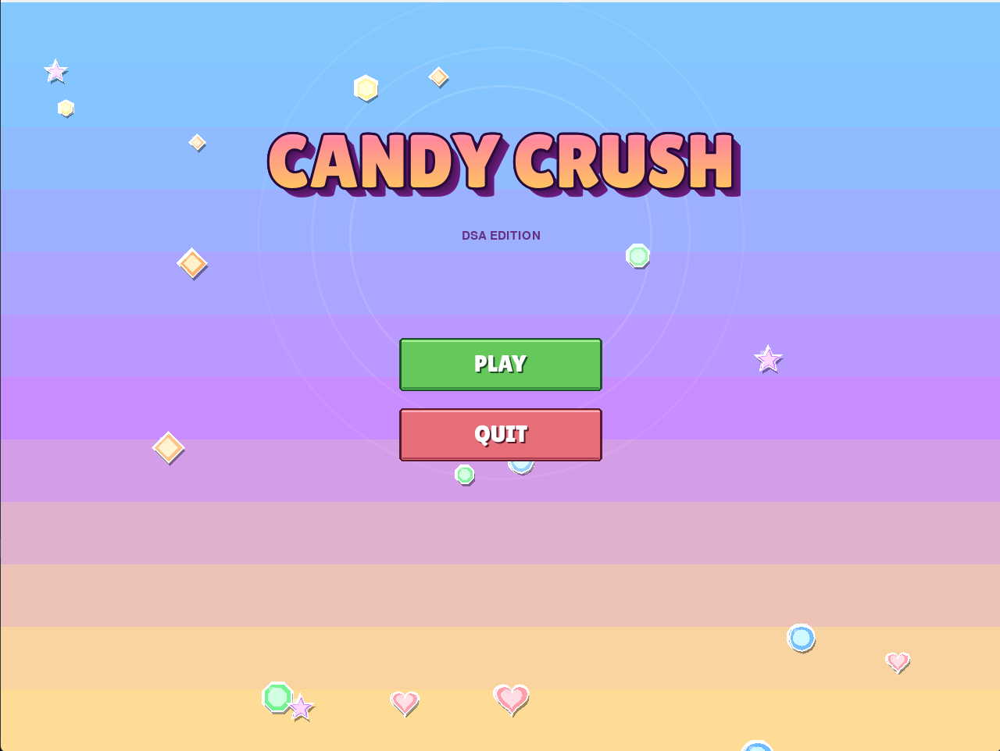
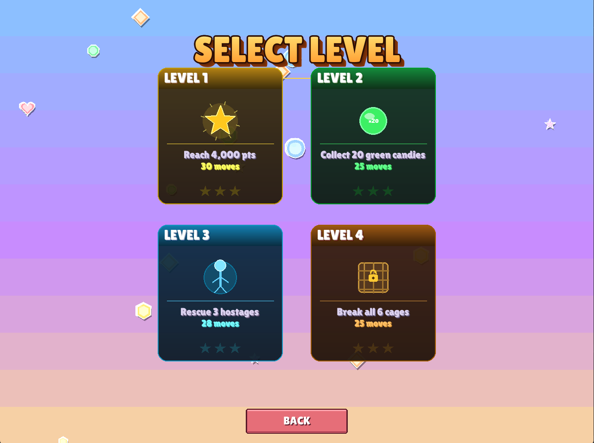
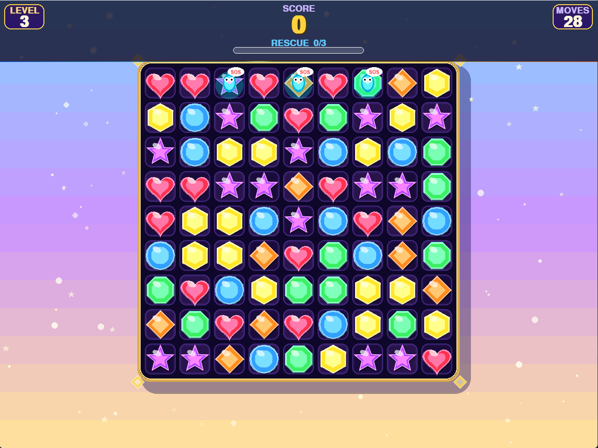
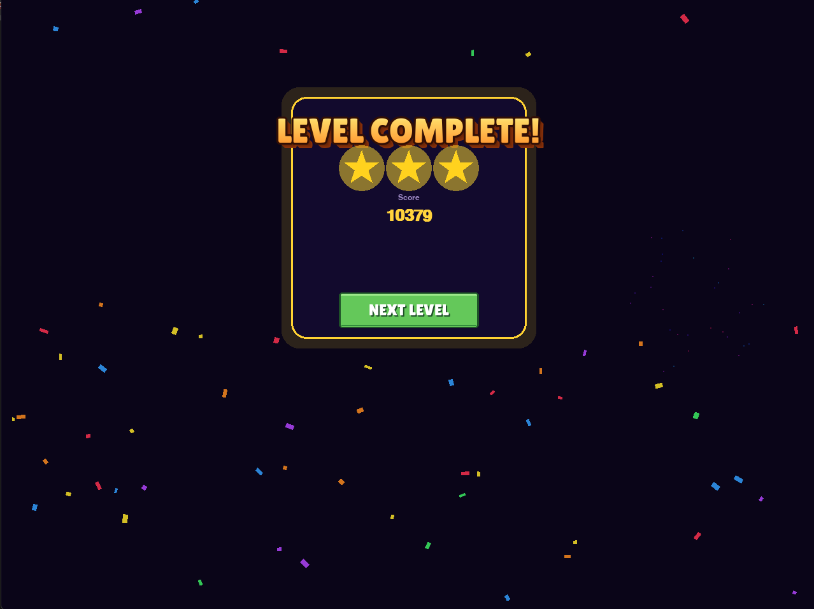
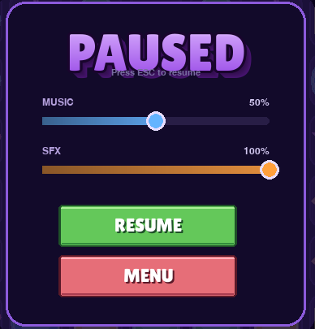
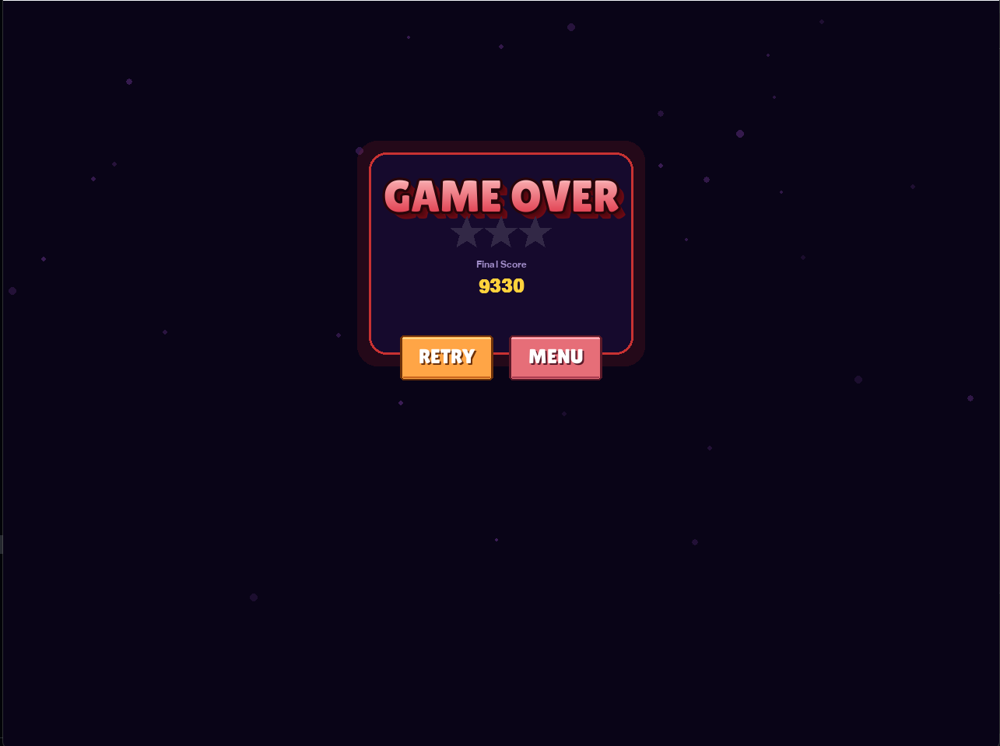

# Candy Crush — DSA Edition

> Trò chơi match-3 phong cách Candy Crush, viết bằng **Python + Pygame** trong khuôn khổ đồ án Cấu trúc Dữ liệu & Giải thuật.
> Trọng tâm: hiện thực hóa các DSA cốt lõi (mảng 2D, hash map, set, FSM, brute-force search có rollback) để vận hành toàn bộ logic match, cascade, gravity, gợi ý nước đi và các loại goal khác nhau.s

---

## Mục lục

- [Tính năng](#tính-năng)
- [Ảnh chụp màn hình](#ảnh-chụp-màn-hình)
- [Hướng dẫn chạy](#hướng-dẫn-chạy)
- [Cấu trúc project](#cấu-trúc-project)
- [DSA highlights](#dsa-highlights)
- [Các loại level (Goal types)](#các-loại-level-goal-types)
- [Special candy](#special-candy)
- [Phím tắt & tương tác](#phím-tắt--tương-tác)
- [Tác giả](#tác-giả)

---

## Tính năng

- **4 loại goal**: đạt điểm, thu thập màu, giải cứu con tin, phá lồng
- **5 loại candy đặc biệt**: Striped ngang / dọc, Wrapped, Color Bomb
- **Combo đặc biệt**: kết hợp 2 special candy cho hiệu ứng mạnh (toàn sàn, chữ thập, 5×5...)
- **Cascade tự động**: gravity + fill + chain match
- **Hint system**: gợi ý nước đi sau 30s không thao tác
- **Animation đầy đủ**: swap, pop, fall, floating score, banner combo, screen shake
- **HUD động**: score animated, combo counter, progress bar, goal strip theo loại level
- **5 màn UI hoàn chỉnh**: Menu, Level Select, Game, Pause, Game Over, Level Complete
- **Phong cách arcade pixel-art**: title 3D extrude + button pixel-art chamfered, hover glow
- **Music & SFX**: nhạc nền, âm thanh swap/pop/special/combo/win/gameover

---

## Ảnh chụp màn hình


| Menu chính | Chọn màn chơi |
|---|---|
|  |  |

| Gameplay | Win screen |
|---|---|
|  |  |

| Pause | Game Over |
|---|---|
|  |  |

---

## Hướng dẫn chạy

### Yêu cầu hệ thống

- **Python**: 3.10 trở lên (vì dùng type hint `list[int]` và `tuple[...]` cú pháp mới)
- **OS**: Windows / macOS / Linux đều chạy được
- **RAM**: 200 MB là đủ
- Cài Python từ [python.org](https://www.python.org/downloads/) nếu chưa có.

### Bước 1 — Clone repo

```bash
git clone https://github.com/Mihucoding/Candy-Crush-Saga-in-python-with-pygame.git
cd DOANDSA
```

### Bước 2 — Tạo virtual environment (khuyến nghị)

**Windows (PowerShell):**
```powershell
python -m venv .venv
.\.venv\Scripts\Activate.ps1
```

**macOS / Linux:**
```bash
python3 -m venv .venv
source .venv/bin/activate
```

### Bước 3 — Cài dependencies

```bash
pip install -r requirements.txt
```

Gói cần thiết:
- `pygame==2.5.2` — game engine
- `pytest==8.0.0` + `pytest-cov==4.1.0` — chạy test (tùy chọn)

### Bước 4 — Chạy game

```bash
python main.py
```

Cửa sổ game 1280×960 sẽ mở. Click **PLAY** → chọn level → chơi.

### Khắc phục lỗi thường gặp

| Lỗi | Cách sửa |
|---|---|
| `ModuleNotFoundError: No module named 'pygame'` | Chưa cài requirements. Chạy lại `pip install -r requirements.txt` |
| `pygame.error: No available audio device` | Nhạc/SFX không phát được nhưng game vẫn chạy. Có thể bỏ qua hoặc cắm tai nghe / mở audio service |
| Game đen kịt khi chạy trên Linux | Cài SDL2: `sudo apt install python3-pygame` hoặc `libsdl2-mixer-2.0-0` |
| Font không hiển thị đúng | File `assets/fonts/LilitaOne.ttf` cần tồn tại, nếu không sẽ fallback về font hệ thống |

---

## Cấu trúc project

```
DOANDSA/
├── main.py                  # Entry point — vòng lặp scene + event loop game
├── constants.py             # SCREEN_WIDTH, CANDY_COLORS, FPS, scoring const...
├── requirements.txt
├── README.md
│
├── game/                    # ─── Logic DSA thuần Python (không import pygame)
│   ├── board.py             # Grid 2D, swap, gravity, fill, cage & hostage
│   ├── candy.py             # Candy entity + activate() + combo_with()
│   ├── match_finder.py      # Quét match hàng/cột, merge nhóm chồng nhau
│   ├── hint_finder.py       # Brute-force tìm gợi ý nước đi
│   ├── score.py             # ScoreTracker với combo multiplier cấp số nhân
│   ├── game_state.py        # Finite State Machine (IDLE→MATCHING→FALLING…)
│   ├── level_config.py      # LevelConfig + ScoreGoal/CollectGoal/RescueGoal/CageGoal
│   └── docs.py
│
├── ui/                      # ─── Tầng hiển thị + animation
│   ├── renderer.py          # Vẽ board, candy, lồng, con tin, hint highlight
│   ├── animations.py        # SwapAnim, PopAnim, FallAnim, particles, banner
│   ├── hud.py               # Score, moves, level pill, progress bar, combo
│   ├── screens.py           # MenuScreen, LevelSelectScreen, GameOverScreen,
│   │                        # LevelCompleteScreen, PauseScreen + pixel button
│   └── sounds.py            # SoundManager — music & SFX
│
└── assets/
    ├── fonts/               # LilitaOne.ttf
    ├── images/              # Sprites (nếu dùng)
    ├── sounds/              # bgm.ogg, swap.wav, pop.wav, win.wav...
    └── screenshots/         # (cho README)
```

**Nguyên tắc tách lớp:**
- `game/` **không import pygame**, chỉ Python thuần — dễ unit test, dễ port.
- `ui/` **chỉ đọc** từ `game/`, không sửa state — đảm bảo logic ↔ render độc lập.
- `constants.py` là single source of truth cho mọi cấu hình.

---

## DSA highlights

| File | Cấu trúc / Thuật toán | Mục đích |
|---|---|---|
| `board.py` | `list[list[Candy]]` (mảng 2D 9×9) | Lưu grid kẹo, truy cập O(1) theo (row, col) |
| `board.py` | `set[tuple]` cho hostages | Membership check O(1) khi con tin rơi |
| `board.py` | `dict[(r,c), int]` cho cages | Vừa check tồn tại vừa lưu HP O(1) |
| `board.py` | **Segment-per-column gravity** | Cage làm vật cản tĩnh, mỗi đoạn cột rơi độc lập |
| `board.py` | **Transactional swap** (try → check → rollback) | Tránh clone toàn grid mỗi lần thử |
| `match_finder.py` | **Linear streak scan** O(R·C) | Tìm 3+ liên tiếp theo trục |
| `match_finder.py` | **Pairwise union merge** | Hợp các nhóm match chồng nhau (hình L/T) |
| `candy.py` | **Strategy pattern qua if-elif** | Mỗi special trả về list ô bị ảnh hưởng |
| `hint_finder.py` | **Brute-force + rollback** O((R·C)²) | Quét tất cả cặp adjacent tìm hint, chỉ chạy khi player idle 30s |
| `score.py` | **Geometric combo multiplier** | `points = base × group × combo^k` — thưởng cho cascade dài |
| `game_state.py` | **Finite State Machine** | 6 trạng thái IDLE/SWAPPING/MATCHING/FALLING/GAMEOVER/WIN |
| `level_config.py` | **Tagged union (dataclass)** | 4 loại goal khác kiểu, dispatch bằng `isinstance` |

Chi tiết hơn xem `AGENTS.md` và `CONTEXT.md`.

---

## Các loại level (Goal types)

| Goal | Cách thắng | Hiển thị HUD |
|---|---|---|
| **ScoreGoal** | Đạt đủ điểm `target` trước khi hết lượt | Progress bar gradient cyan→gold→red |
| **CollectGoal** | Thu thập đủ `count` viên một màu cố định | Strip icon kẹo + bộ đếm n/N |
| **RescueGoal** | Để con tin rơi xuống đáy đủ `count` lần | Counter RESCUE x/N |
| **CageGoal** | Phá hết tất cả lồng trên board | Counter CAGES LEFT N |

---

## Special candy

| Tên | Tạo bởi | Hiệu ứng |
|---|---|---|
| **STRIPED_H** | Match 4 ngang | Xóa toàn hàng ngang |
| **STRIPED_V** | Match 4 dọc | Xóa toàn cột dọc |
| **WRAPPED** | Match hình L/T (≥5) | Xóa vùng 3×3 |
| **COLOR_BOMB** | Match 5 thẳng hàng | Xóa toàn bộ kẹo cùng màu mục tiêu |

**Combo 2 special** (swap 2 viên đặc biệt vào nhau):

| Kết hợp | Hiệu ứng |
|---|---|
| Bomb + Bomb | Xóa toàn sàn |
| Bomb + Striped/Wrapped | Biến tất cả viên cùng màu thành special đó rồi nổ |
| Striped + Striped | Chữ thập (1 hàng + 1 cột) |
| Wrapped + Striped | Chữ thập dày (3 hàng + 3 cột) |
| Wrapped + Wrapped | Vùng 5×5 |

---

## Phím tắt & tương tác

| Hành động | Cách thực hiện |
|---|---|
| Chọn / swap kẹo | Click chuột trái |
| Mở menu pause | Nhấn `ESC` |
| Đóng pause | Nhấn `ESC` lần nữa hoặc click **RESUME** |
| Chỉnh âm lượng nhạc / SFX | Kéo slider trong màn Pause |
| Thoát game | Đóng cửa sổ hoặc click **QUIT** ở menu |

---

## Tác giả

Đồ án môn **Cấu trúc Dữ liệu & Giải thuật** — Phan Đình Minh Huân.

Đóng góp / báo lỗi: mở Issue trên GitHub repo này.

---

*Built with Python 3.10+ & Pygame 2.5.2*
